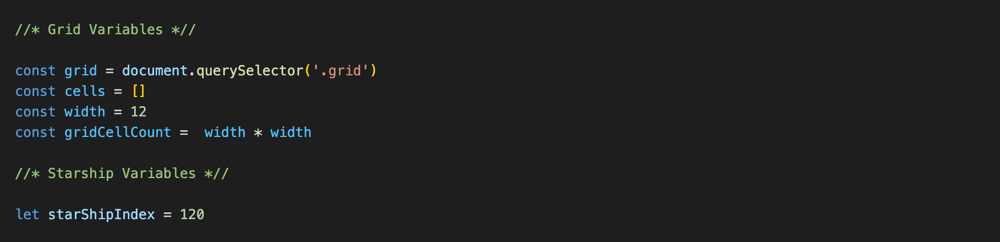
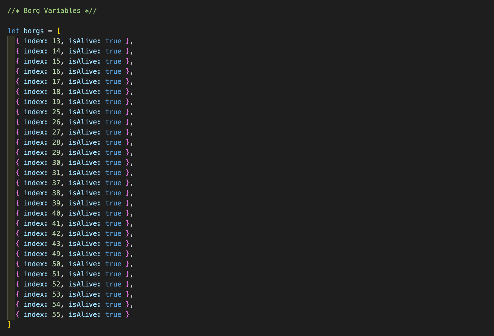
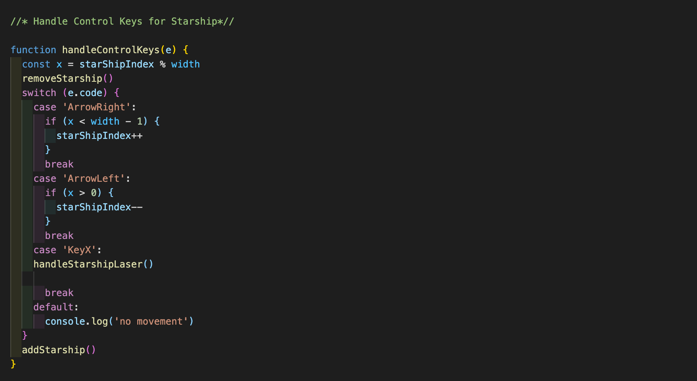
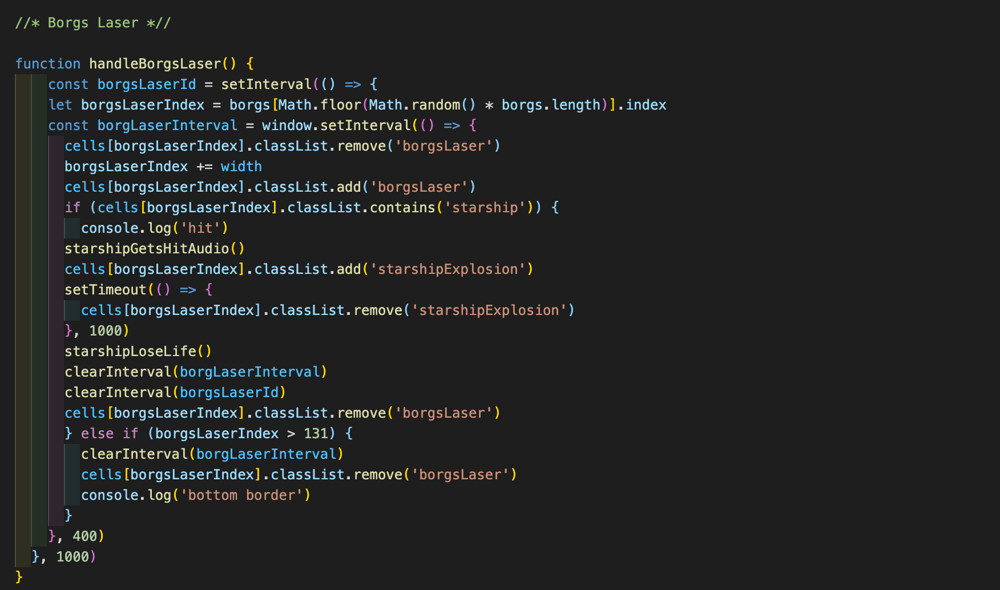
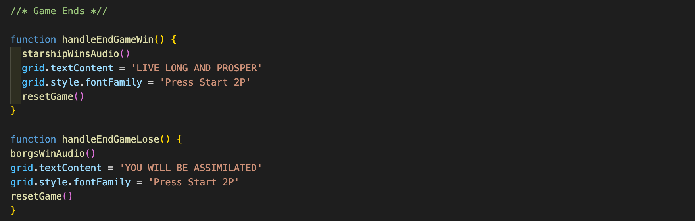
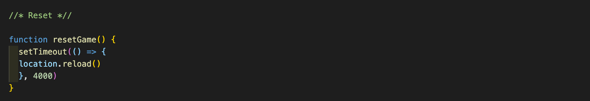

# Project 1 - Space Invaders - Federation vs Borg

# Overview
Space Invaders is a classic 80s Taito arcade game. The player, moving left or right, aims to shoot an invading alien armada and achieve the highest score possible before either being eradicated by lasers that the aliens shoot periodically, or allowing the armada to reach Planet Earth's surface.
My version is a take on the classic Space Invaders arcade game with Borg theme. This grid base single player game is my first dev project built with HTML, CSS, Vanilla JavaScript and GitHub.

# Brief:
1. Render a grid based game in the browser
2. Create a one-player game against the computer
3. The computer should be able to make random attacks on the players board
4. The player should be able to attack the Borg played by the computer
5. Include separate HTML, CSS and JavaScript files

# Controls
* Press the Start button on the page to move the Borg.
* Use your right and left arrow keys to move the starship.
* Click on X on your keyboard to shoot the Borg.

# Deployment
The game has been deployed with GitHub Pages and is available [here](https://esinyilmazbilek.github.io/sei-project-one/).

# Timeframe
7 days

# Goals
* To create a fully functioning browser-based game of Space Invaders with vanilla JavaScript.

# Technologies Used
* HTML5 with HTML5 audio
* CSS3 with animation
* JavaScript
* GitHub
* Google Fonts

# Process
### Planning:
I started developing the game by planning all the functionalities the game should have, and put them into two lists, one for MVP and others for Stretch Goals. I then started breaking down the steps to reach my MVP to give myself enough time and make sure I can deliver the final project by the deadline.

For reference: Even though the plural of Borg is still Borg, you will see that I used the word Borgs to reference the whole armada for the naming conventions in my code.

### Build:

1. As I was building the game on a single JS file, I made titled sections on the page to help myself navigate.

2. I created the game grid by setting a value for width and used a for-loop to create a div element while the index value was less than width times width. The divs were pushed to an empty array and appended to the grid div in my HTML.

3. I created and placed the Borg ships on the grid by creating an array which included the index values of the squares on the grid. I then wrote the function to have them move from left to right until they reach the right border, move one row down and change direction to the opposite way until they reach the row on the grid where the player is located. I created a timer for the Borg ship movement that reflects the human heart beat. 

4. I worked on creating the player ship and have it move on the y axis via the arrow keys on the keyboard. 

5. Once the Borg and player ships were moving correctly within the grid, I added the shooting functionality. For the Borg ship, the beams are generated randomly from all the ships in the armada. If any of these beams hit the player ship the player ship gets removed and loses a life.

6. After building the code for the Borg laser, I followed a similar path for the starship laser function.

7. On every instance the player lasers hit the Borg armada, the hit Borg ship is removed from the array and the scoreboard is updated with 1000 points. If all Borg ships are shot before they can reach the player row, handleEndGameWin() function is called. If the player ship is hit 3 times during the attack, the handleEndGameLose() function is called.

8. In both cases the grid is cleared, and the player can reset the game and start again.

9. Once the game was functioning how I planned, I added sound files to give it a vintage feeling. Sound files play upon starting the game, when the Borg and the player shoot lasers.

# Challenges
Being my first project on the course, I faced many challenges, of which the biggest were:
* Getting the Borg ships to move correctly within the grid: Initially I had problems with keeping them on the same columns when they moved one row down. I had to change how I wrote the if statements in the handleBorgMove() function and how I defined the borders to fix this issue.
* Movement of the laser beams on the grid: Early in the development process the code would break when the laser beams reached the top or the bottom edge of the grid. I fixed the issue by adding the correct else if statements in the laser functions.

# Wins
* I gained experience in critical thinking, problem solving and planning the various stages and functions of the game.
* Being a solo project, I had to be motivated and dedicated when I hit a roadblock and while I was getting help from my TA, I also learned how to look for tips online and debug several issues on my own.
* Besides being my biggest challenge at the time I had a great time developing the game and giving it the Borg look.

# Future improvements
There are some features I would like to add going forward:
 1. The mothership, different hit scores for each invader row, additional levels for the player, speeding invaders as the player moves onto the next levels and bunkers for the player ship to hide under.
 2. Improving the page layout and making it responsive for mobile and tablet screens.

# Key Learnings
Building a browser game from scratch with JavaScript was a great and fun way to consolidate my learnings and develop further skills. It helped me to see the functions I created as stories within themselves, with components working together and reaching an end point. This project also taught me a lot about DOM manipulation, dynamically updating data on the browser, JavaScript array methods, and setting intervals. 

